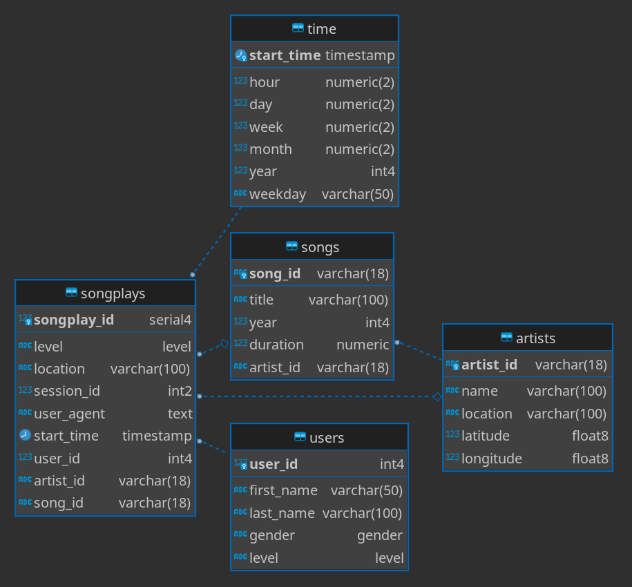
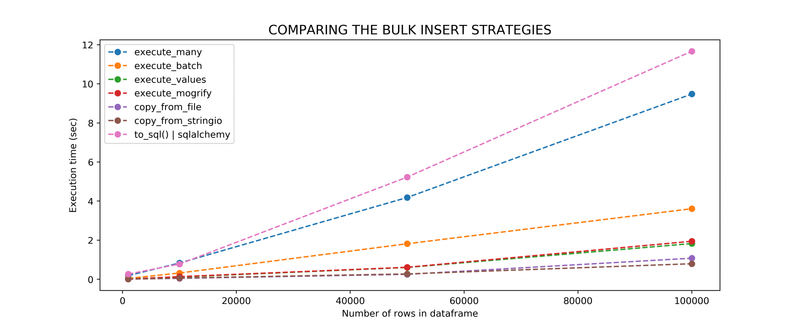
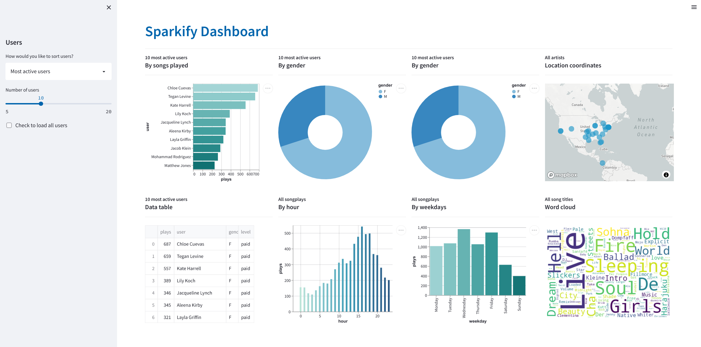

# Sparkify Database
<br/>

>Author: Rodrigo de Alvarenga Mattos
>
>June 5, 2022

<br/>

## Introduction

The goal of this project is to create a database solution optimized for queries and analysis of users' song play activities for the Sparkify service. 

This new design solved the difficulty that the analytics team experienced when looking for information in the JSON log and metadata files.
<br/>
<br/>

## Project Dependencies

- [Python 3.10](https://www.python.org) 
- [Altair Viz 4.2.0](https://altair-viz.github.io) 
- [Matplotlib 3.5.2](https://matplotlib.org)
- [Pandas 1.4.2](https://pandas.pydata.org)
- [Psycopg2 2.9.3](https://www.psycopg.org)
- [SqlAlchemy 1.4.37](https://www.sqlalchemy.org)
- [Streamlit 1.10.0](https://streamlit.io)
- [Wordcloud 1.8.1](https://github.com/amueller/word_cloud)
<br/>
<br/>

## JSON Data Files Schema
<br/>

1. **Song Dataset** - The JSON files, located in the directory [data/song_data](./data/song_data), are a subset of the [Million Song Dataset](http://millionsongdataset.com) and each file contains the following data schema:
   
```javascript
{
    "num_songs": 1,
    "artist_id": "ARD7TVE1187B99BFB1",
    "artist_latitude": null,
    "artist_longitude": null,
    "artist_location": "California - LA",
    "artist_name": "Casual",
    "song_id": "SOMZWCG12A8C13C480",
    "title": "I Didn't Mean To",
    "duration": 218.93179,
    "year": 0
}
```
<br/>

1. **Log Dataset** - The JSON files, located in the directory [data/log_data](./data/log_data), were generated by an [event simulator](https://github.com/Interana/eventsim) according to the songs data from the previous dataset, and each file contains the following data schema:
```javascript
{
    "artist":"The Mars Volta",
    "auth":"Logged In",
    "firstName":"Kaylee",
    "gender":"F",
    "itemInSession":5,
    "lastName":"Summers",
    "length":380.42077,
    "level":"free",
    "location":"Phoenix-Mesa-Scottsdale, AZ",
    "method":"PUT",
    "page":"NextSong",
    "registration":1540344794796.0,
    "sessionId":139,
    "song":"Eriatarka",
    "status":200,
    "ts":1541106673796,
    "userAgent":"\"Mozilla\/5.0 (Windows NT 6.1; WOW64) AppleWebKit\/537.36 (KHTML, like Gecko) Chrome\/35.0.1916.153 Safari\/537.36\"",
    "userId":"8"
}
```
<br/>
<br/>

## Database Schema Design

The database is modeled as a star schema that consists of a fact table (songplays) referencing four dimension tables (artists, songs, time, users), and some custom types have also been defined.

All the SQL types and tables were defined in the [sql_queries.py](./sql_queries.py) file.

The figure below shows the database structure as an entity relationship diagram:


<br/>
<br/>

## Creating the Database

The sample code below shows the main pipeline of the database creation process in the [create_tables.py](./create_tables.py) script:

```python
drop_tables(cur, conn)
drop_functions(cur, conn)
drop_types(cur, conn)
create_types(cur, conn)
create_tables(cur, conn)
create_functions(cur, conn)
```
<br/>

*Note:* You should change the [create_tables.py](./create_tables.py) source code if you want to customize the database connection host, database name, username and password.

**Run the command** below to create the database schema:

```bash
# to create the schema in the local database
python -m create_tables 
# to create the schema in the cloud database
python -m create_tables --cloud
```
<br/>
<br/>

## ETL Pipeline Development

The ETL processes were developed in **two phases**. The first one implements the **project requirements** as specified. The second one is a full code refactoring emphasizing **performance improvement** and adding some extra transformations.

So we have a code file for **phase 1** - [etl.py](./etl.py) - and another for **phase 2** - [etl2.py](./etl2.py). Both codes are fully functional, but the second one is significantly faster and adds important transformations. The table below shows the sequence of the ETL pipeline processes:

| Process             | [etl.py](./etl.py)     | [etl2.py](./etl2.py)                       |
|---------------------|------------------------|--------------------------------------------|
| Process log files   | Sequential             | Single DataFrame concatenation             |
| Process song files  | Sequential             | Single DataFrame concatenation             |
| String Trim         | *none*                 | Full DataFrame transformation              |
| Timestamp type cast | Pandas datetime        | Pandas datetime                            |
| User ID type cast   | Pandas Int64           | Pandas Int64                               |
| User ID null values | *none*                 | Generated from user table data             |
| SQL table inserts   | One db call per record | Batch copy_from an StringIO buffer **(1)** |
| SQL songs query     | One db call per record | Batch select with stored procedure **(2)** |
<br/>

**Note:** Take a look at notebooks [etl.ipybn](./etl.ipynb) and [etl2.ipynb](./etl2.ipynb) to understand the step-by-step development of each ETL process described above.
<br/>
<br/>

1. **Batch ```copy_from``` an StringIO buffer:** The [psycopg2 copy_from](https://www.psycopg.org/docs/cursor.html) cursor method was selected based on the information presented in this [benchmark](https://naysan.ca/2020/05/09/pandas-to-postgresql-using-psycopg2-bulk-insert-performance-benchmark/). The figure below shows that this is the fastest operation of this library.


<br/>
<br/>


2. **Batch Select with Stored Procedure:** According to the project requirements, the for loop with thousands of query selections, combined with a join operation, was the most critical point of performance bottlenecks. The average execution time was approximately 22 seconds on the local and the cloud database. The SQL code shown below reduced this time to less than 1 second in a single batch operation:

```sql
CREATE OR REPLACE FUNCTION song_artist_ids(list SONG_ARTIST[])
RETURNS TABLE(index INTEGER, song_id VARCHAR(18), artist_id VARCHAR(18)) AS
$func$
   SELECT $1[i].index, songs.song_id, songs.artist_id
   FROM   generate_subscripts($1, 1) i
   JOIN   songs ON songs.title = $1[i].title
                AND songs.duration = $1[i].duration
   JOIN   artists ON artists.name = $1[i].artist
$func$  LANGUAGE SQL STABLE;
```
<br/>

**Run the command** below to execute the ETL pipeline:

```bash
# first version
python -m etl 
# first version with cloud db
python -m etl --cloud

# second version with improved performance
python -m etl2
# second version with improved performance and cloud db
python -m etl2 --cloud
```
<br/>

| 5 Executions Mean (sec) | [etl.py](./etl.py) | [etl2.py](./etl2.py) |
|-------------------------|--------------------|----------------------|
| Local database          | 30.68              | 1.64                 |
| Cloud database          | 31.44              | 4.72                 |
<br/>

**Note:** These results can vary remarkably according to your local computer hardware and the cloud provider service.
<br/>
<br/>

## Database Schema Validation and Sanity Tests

The [test.ipynb](./test.ipynb) notebook defines a set of test to validate the database table schema, data types, column constraints, primary keys and upsert conflict checks. You should run the **tests after** the execution of the [create_tables.py](./create_tables.py) and [etl2.py](./etl2.py) (or [etl.py](./etl.py)) scripts.
<br/>
<br/>

## Dashboard and Analytics

The [Streamlit](https://streamlit.io) application framework was used to build an interactive analytics dashboard. The following table describes the main application features and resources:

| Feature or Resource   | URL                                                                                               |
|-----------------------|---------------------------------------------------------------------------------------------------|
| Dashboard Application | [www.datadiver.dev](https://datadiver.dev)                                                        |
| Github source code    | [Github repository](https://github.com/rodrigoalvamat/datadiver)                                  |
| SQL Analytics         | [queries.py](https://github.com/rodrigoalvamat/datadiver/blob/main/sparkify/dashboard/queries.py) |
| Cloud PaaS            | [Heroku](https://heroku.com)                                                                      |
| Cloud PostgresSQL     | [ElephantSQL](https://www.elephantsql.com/)                                                       |
<br/>
<br/>

### Dashboard Screenshot

<br/>
<br/>

There were some limitations to developing a more interactive dashboard, with a greater variety of information, because of the missing data in the JSON files and some restrictions defined by the project requirements. However, several improvements are on the roadmap to overcome this issues:

### Next Release Roadmap
- Download a larger sample of the [Million Song Dataset](http://millionsongdataset.com) and use the [event simulator](https://github.com/Interana/eventsim) to improve the dataset quality.
- Use the [Google Maps API Python Client](https://github.com/googlemaps/google-maps-services-python) geocode method to get the latitude and longitude for the songplays' locations. 
- Create interactive graph and vizualization components for all dimensions (songs, artists, users, time) of the fact table (songplays).
- Docstring documentation of the dashboard source code.
